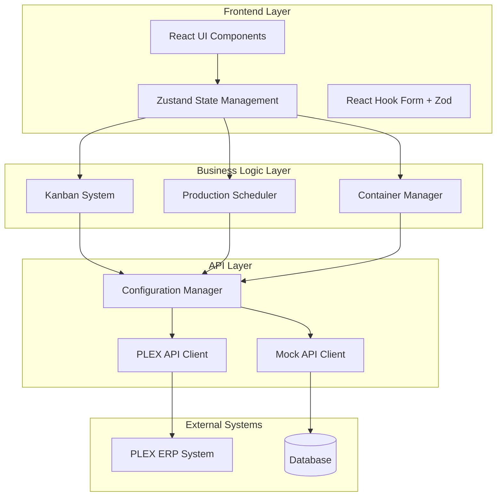

# PLEX ERP Automation System

[](https://opensource.org/licenses/MIT)
[](https://www.typescriptlang.org/)
[](https://reactjs.org/)
[](https://nextjs.org/)
[](https://jestjs.io/)

> A modern digital automation layer for PLEX ERP that replaces physical kanban cards and manual manufacturing processes with intelligent, automated workflows.

## 📋 Table of Contents

- [Overview](#overview)
- [Features](#features)
- [Architecture](#architecture)
- [Quick Start](#quick-start)
- [Installation](#installation)
- [Configuration](#configuration)
- [Development](#development)
- [Testing](#testing)
- [API Documentation](#api-documentation)
- [Deployment](#deployment)
- [Contributing](#contributing)
- [Troubleshooting](#troubleshooting)
- [License](#license)

## 🎯 Overview

The PLEX ERP Automation System transforms traditional manufacturing workflows by digitizing physical kanban cards and manual processes. This system integrates seamlessly with existing PLEX ERP infrastructure to provide:

- **Digital Kanban Management**: Replace physical cards with automated digital workflows
- **Real-time Production Scheduling**: Intelligent job prioritization and override capabilities
- **Container Tracking**: Advanced serial number management with split/merge operations
- **Inventory Automation**: Automated material movement between production areas
- **Quality Control Integration**: Streamlined quality issue resolution workflows

### Problem Statement

Traditional manufacturing environments rely on physical kanban cards for:
- Material withdrawal instructions
- Production scheduling
- Container tracking
- Quality control processes

This manual approach leads to:
- ❌ Inefficient material flow
- ❌ Delayed production scheduling
- ❌ Error-prone manual tracking
- ❌ Limited visibility into operations

### Solution

Our digital automation layer provides:
- ✅ **Automated Workflows**: Digital kanban cards with intelligent routing
- ✅ **Real-time Visibility**: Live updates across all production areas
- ✅ **Error Reduction**: Automated validation and error handling
- ✅ **Scalable Operations**: Support for complex manufacturing environments

## 🚀 Features

### Core Functionality

#### 1. Digital Kanban System
| Kanban Type | Purpose | Digital Equivalent |
|-------------|---------|-------------------|
| **Green Cards** | End of line stock → TPA | Automated withdrawal with TPA routing |
| **Dark Blue Cards** | End of line stock → Pool Stock | Intelligent stock level management |
| **Light Blue Cards** | Pool Stock → TPA | Automated pool-to-TPA transfers |

#### 2. Production Scheduling
- **Job Management**: Create, update, and prioritize production jobs
- **Work Center Assignment**: Intelligent machine allocation
- **Priority Override**: Real-time schedule adjustments
- **Completion Tracking**: Automated job status updates

#### 3. Container Management
- **Serial Number Tracking**: Unique identifier management
- **Split Operations**: Quality issue resolution workflows
- **Merge Operations**: Container consolidation with new serial numbers
- **Location Tracking**: Real-time container location updates

#### 4. Inventory Automation
- **Real-time Monitoring**: Live inventory level tracking
- **Automated Replenishment**: Intelligent stock level management
- **Quality Control**: Integrated quality issue workflows
- **Material Flow**: Automated movement between production areas

### Technical Features

- **Modern React/Next.js**: TypeScript-based frontend with App Router
- **Real-time Updates**: Live data synchronization with PLEX ERP
- **Responsive Design**: Mobile-first UI with Tailwind CSS
- **Comprehensive Testing**: Jest, React Testing Library, and Cypress
- **Mock Data System**: Full development environment without PLEX access
- **Type Safety**: Complete TypeScript coverage

## 🏗️ Architecture



### Technology Stack

| Layer | Technology | Purpose |
|-------|------------|---------|
| **Frontend** | React 18 + Next.js 14 | Modern UI with SSR capabilities |
| **Styling** | Tailwind CSS | Utility-first responsive design |
| **State** | Zustand | Lightweight state management |
| **Forms** | React Hook Form + Zod | Type-safe form handling |
| **Testing** | Jest + RTL + Cypress | Comprehensive test coverage |
| **Language** | TypeScript 5.0 | Type safety and developer experience |

## ⚡ Quick Start

### Prerequisites

- Node.js 18+ 
- npm 9+ or yarn 1.22+
- Modern web browser

### 1. Clone the Repository

```bash
git clone https://github.com/your-username/erp-automation-system.git
cd erp-automation-system
```

### 2. Install Dependencies

```bash
npm install
```

### 3. Start Development Server

```bash
npm run dev
```

### 4. Access the Application

Open [http://localhost:3000](http://localhost:3000) in your browser.

The system will automatically use mock data for development and testing.

## 📦 Installation

### Development Environment Setup

1. **Install Node.js**: Download from [nodejs.org](https://nodejs.org/)

2. **Clone Repository**:
   ```bash
   git clone https://github.com/your-username/erp-automation-system.git
   cd erp-automation-system
   ```

3. **Install Dependencies**:
   ```bash
   npm install
   ```

4. **Environment Configuration**:
   ```bash
   cp env.example .env.local
   # Edit .env.local with your PLEX credentials (optional for development)
   ```

5. **Start Development Server**:
   ```bash
   npm run dev
   ```

### Production Deployment

See [Deployment Guide](./docs/DEPLOYMENT.md) for detailed production setup instructions.

## ⚙️ Configuration

### Environment Variables

Create a `.env.local` file in the project root:

```env
# PLEX ERP Configuration (Required for production)
PLEX_API_URL=https://your-plex-instance.com/api
PLEX_API_KEY=your_api_key_here
PLEX_CLIENT_ID=your_client_id_here

# Application Configuration (Optional)
NEXT_PUBLIC_APP_NAME=PLEX ERP Automation
NEXT_PUBLIC_APP_VERSION=1.0.0
NODE_ENV=development
```

### Feature Flags

The system supports feature flags for gradual rollout:

```typescript
// src/lib/config.ts
export const config = {
  features: {
    useMockData: !process.env.PLEX_API_URL,
    enableRealTimeUpdates: true,
    enableAdvancedScheduling: true,
  }
}
```

## 🛠️ Development

### Project Structure

```
src/
├── app/                    # Next.js App Router pages
│   ├── globals.css        # Global styles
│   ├── layout.tsx         # Root layout
│   └── page.tsx           # Main dashboard
├── components/             # Reusable React components
│   ├── ContainerManager.tsx
│   └── ProductionScheduler.tsx
├── lib/                   # Business logic and utilities
│   ├── config.ts          # Configuration management
│   ├── kanban-system.ts   # Kanban business logic
│   ├── mock-plex-api.ts   # Mock API implementation
│   └── plex-api.ts        # PLEX API client
└── __tests__/             # Test files
    ├── components/
    └── lib/
```

### Available Scripts

| Script | Description |
|--------|-------------|
| `npm run dev` | Start development server |
| `npm run build` | Build for production |
| `npm run start` | Start production server |
| `npm run lint` | Run ESLint |
| `npm run type-check` | Run TypeScript type checking |
| `npm test` | Run unit tests |
| `npm run test:watch` | Run tests in watch mode |
| `npm run test:coverage` | Run tests with coverage |
| `npm run test:e2e` | Run E2E tests |
| `npm run test:e2e:open` | Open Cypress test runner |

### Development Workflow

1. **Feature Development**:
   ```bash
   git checkout -b feature/your-feature-name
   npm run dev
   # Make changes and test
   npm test
   npm run lint
   ```

2. **Testing**:
   ```bash
   # Run all tests
   npm test
   
   # Run E2E tests
   npm run test:e2e
   ```

3. **Code Quality**:
   ```bash
   # Type checking
   npm run type-check
   
   # Linting
   npm run lint
   ```

## 🧪 Testing

### Test Strategy

| Test Type | Framework | Coverage | Purpose |
|-----------|-----------|----------|---------|
| **Unit Tests** | Jest + RTL | Components, Utils | Individual component behavior |
| **Integration Tests** | Jest + RTL | API Integration | End-to-end workflows |
| **E2E Tests** | Cypress | User Journeys | Complete user scenarios |

### Running Tests

```bash
# Unit tests
npm test

# Unit tests with coverage
npm run test:coverage

# E2E tests
npm run test:e2e

# Open Cypress test runner
npm run test:e2e:open
```

### Test Structure

```
src/__tests__/
├── components/
│   └── ProductionScheduler.test.tsx
└── lib/
    └── mock-plex-api.test.ts

cypress/
├── e2e/
│   └── dashboard.cy.ts
└── support/
    ├── e2e.ts
    └── commands.ts
```

### Mock Data

The system includes comprehensive mock data for testing:

- **Jobs**: 3 sample jobs with different priorities
- **Inventory**: 3 inventory items with containers
- **Customer Orders**: 3 orders with different statuses
- **Containers**: Multiple containers with unique serial numbers
- **Work Centers**: 3 active work centers

## 📚 API Documentation

### PLEX API Integration

The system integrates with PLEX ERP through a custom API client:

```typescript
// Example API usage
import { getApiClient } from '@/lib/config';

const api = await getApiClient();
const jobs = await api.getJobs();
const inventory = await api.getInventory();
```

### Available Endpoints

| Endpoint | Method | Description |
|----------|--------|-------------|
| `/api/jobs` | GET | Retrieve all jobs |
| `/api/jobs/:id` | GET | Get specific job |
| `/api/jobs` | POST | Create new job |
| `/api/inventory` | GET | Get inventory levels |
| `/api/containers` | GET | Get container data |
| `/api/work-centers` | GET | Get work center data |

### Mock API

For development without PLEX access, the system provides a comprehensive mock API:

```typescript
// Mock API automatically used when PLEX credentials not configured
const mockApi = new MockPlexApiClient();
const jobs = await mockApi.getJobs(); // Returns mock data
```

## 🚀 Deployment

### Production Build

```bash
# Build the application
npm run build

# Start production server
npm run start
```

### Environment Setup

1. **Production Environment Variables**:
   ```env
   NODE_ENV=production
   PLEX_API_URL=https://your-plex-instance.com/api
   PLEX_API_KEY=your_production_api_key
   PLEX_CLIENT_ID=your_production_client_id
   ```

2. **Security Considerations**:
   - Use HTTPS in production
   - Implement proper authentication
   - Configure CORS appropriately
   - Set up monitoring and logging

### Deployment Options

- **Vercel**: Zero-config deployment
- **Netlify**: Static site deployment
- **AWS/GCP/Azure**: Container deployment
- **Self-hosted**: Traditional server deployment

## 🤝 Contributing

We welcome contributions! Please see our [Contributing Guide](./docs/CONTRIBUTING.md) for details.

### Development Setup

1. Fork the repository
2. Create a feature branch
3. Make your changes
4. Add tests for new functionality
5. Ensure all tests pass
6. Submit a pull request

### Code Standards

- Follow TypeScript best practices
- Write comprehensive tests
- Use conventional commit messages
- Follow the existing code style

## 🔧 Troubleshooting

### Common Issues

#### 1. "Part not found" Error
**Problem**: Part number not recognized in kanban creation
**Solution**: Use valid part numbers from mock data (PART-001, PART-002, PART-003)

#### 2. 404 Not Found API Errors
**Problem**: API calls failing during development
**Solution**: Ensure mock data is being used by checking configuration

#### 3. TypeScript Errors
**Problem**: Type checking failures
**Solution**: Run `npm run type-check` and fix type issues

#### 4. Test Failures
**Problem**: Tests not passing
**Solution**: 
```bash
npm test -- --verbose
npm run test:coverage
```

### Getting Help

- 📖 [Documentation](./docs/)
- 🐛 [Issue Tracker](https://github.com/your-username/erp-automation-system/issues)
- 💬 [Discussions](https://github.com/your-username/erp-automation-system/discussions)

## 📄 License

This project is licensed under the MIT License - see the [LICENSE.md](./LICENSE.md) file for details.

## 🙏 Acknowledgments

- PLEX ERP for the underlying manufacturing system
- React and Next.js communities for the excellent frameworks
- Contributors and maintainers

---

**Built with ❤️ for modern manufacturing automation**
